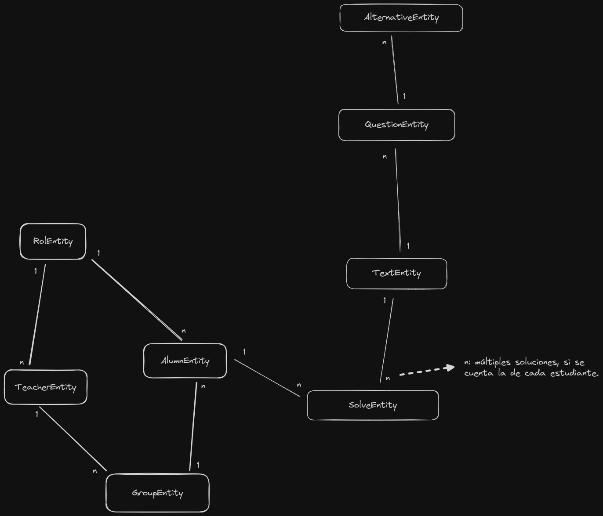

# proyecto-algorítmica2
Instrucciones
- Instalar MySQL
- Crear una bd:

**CREATE DATABASE readdb;**

En el archivo "application.properties"
- spring.datasource.username=root
- spring.datasource.password=1234
- Colocar el username y el password que se puso al instalar MySQL

  <strong>Modelo de las relaciones entre clases</strong>

  <strong>Modelo de la Base de Datos</strong>

